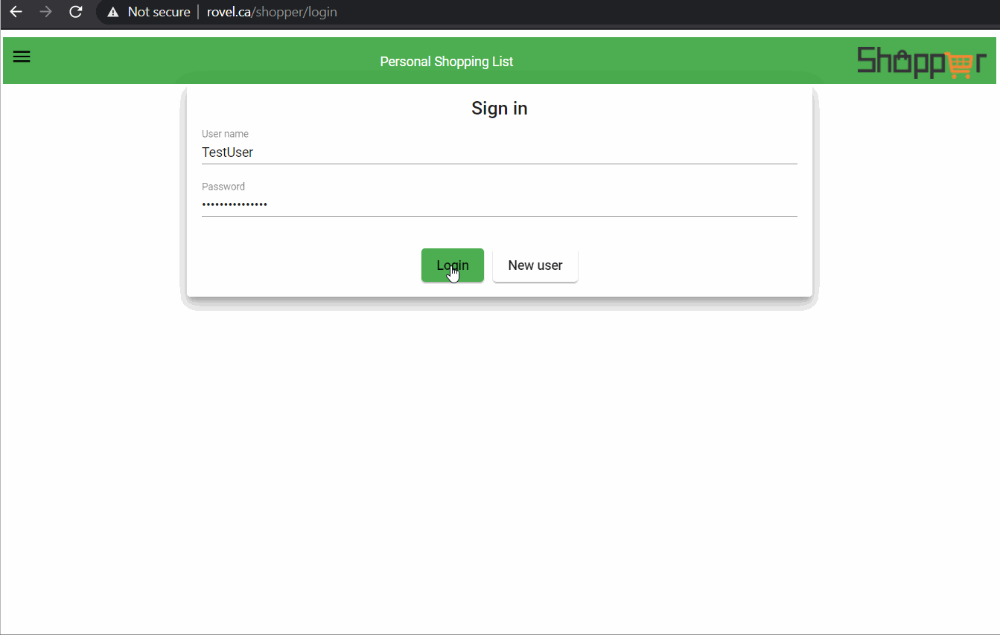

    

  **Shopper App** - Personal Shopping List Web App for convenient grocery shopping. Add items in shopping list and the separate list for each shop will be generated. Tick off items as you do your shpopping. My personal project implemented using Typescript / Angular. Front End UI using Angular Material / Forms. Backend server implemented using Angular/NestJS and PostgresSQL database.
  
## Contents

1. [Contents](#contents)
2. [Screenshot](#screenshot)
3. [Installation](#installation)
4. [Usage](#usage)
5. [License](#license)
6. [Questions](#questions)

### Screenshot

## Installation

For local installation download repo from link provided, install dependencies and run `npm start`  
All app code is available at repository [https://github.com/elogonme/shopper](https://github.com/elogonme/shopper)

## Usage

Use TestUser to sign in to check app and features. Create your own user for personal shopping list. Add Items to buy in New Item Dialog and enter in which Shop you are planning to buy item. App will create separate tabs for each Shop with sorted items per shop. Also can view full list in Shopping List tab. Tick off items as they are done and list will update accordingly. Click on bin icon to delete all ticked off items. Click on X icon to delete single item. Click on Clear List button to delelete full list completely. Click on any Item description to edit item.  

Application can be accessed at [http://rovel.ca/shopper/](http://rovel.ca/shopper/)

## License

Licensed under the 

## Questions

For any questions use contacts below:  
        :construction_worker: Developer: Eldar  Humbatov  
        :email: Email: [elogon@gmail.com](mailto:elogon@gmail.com)  
        :boom: GitHub: [https://github.com/elogonme](https://github.com/elogonme)
  
  *Generated by [readme-generator](https://github.com/elogonme/readme-generator/)*
  
